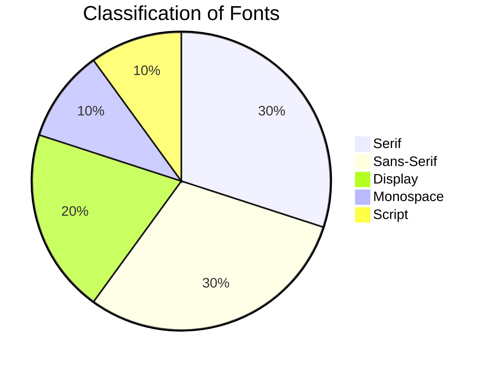

<p align="center">
    
</p>
<h1 align="center" style='border-bottom: none;'>font.gl</h1>
<h3 align="center">Variable Font Collection</h3>

<br/>

<div align="center">

[
](https://www.font.gl)
[](https://www.npmjs.com/package/font.gl)
[](https://vscode.dev/redirect?url=vscode://ms-vscode-remote.remote-containers/cloneInVolume?url=https://github.com/stylescape/font.gl)
[](https://stackblitz.com/github/stylescape/font.gl/tree/main?file=src%2Findex.html)
[](https://github.com/stylescape/font.gl/blob/main/LICENSE)

</div>

<div align="center">

[](https://github.com/stylescape/font.gl/issues/new?assignees=&labels=Needs%3A+Triage+%3Amag%3A%2Ctype%3Abug-suspected&projects=&template=bug_report.yml)
[](https://github.com/stylescape/font.gl/issues/new?assignees=&labels=Needs%3A+Triage+%3Amag%3A%2Ctype%3Abug-suspected&projects=&template=feature_request.yml)
[](https://github.com/stylescape/font.gl/issues/new?assignees=&labels=Needs%3A+Triage+%3Amag%3A%2Ctype%3Abug-suspected&projects=&template=question.yml)
[](https://github.com/stylescape/font.gl/issues/new?assignees=&labels=Needs%3A+Triage+%3Amag%3A%2Ctype%3Abug-suspected&projects=&template=suggestion.yml)
[](https://github.com/stylescape/font.gl/issues/new?assignees=&labels=Needs%3A+Triage+%3Amag%3A%2Ctype%3Abug-suspected&projects=&template=discussion.yml)

</div>

---

<br/>

**Curated Open-Source Variable Font Library by Scape Agency**

## Overview

**font.gl** (Shodō) is a meticulously curated, open-source font library initiated by the design enthusiasts at Scape Agency. With a vision to empower designers, developers, and content creators, font.gl offers an array of diverse and high-quality typefaces that cater to various design needs — be it for branding, web design, print, or other creative projects.

## Features

1. **Curated Collection**: Every font in font.gl has undergone a rigorous selection process to ensure quality, readability, and aesthetic appeal.

2. **Diverse Styles**: From serif and sans-serif to hand-lettered and decorative fonts, font.gl hosts a wide range of styles to fit diverse design requirements.

3. **Open-Source Licensing**: Each font in the library is open-source, which means you can use it for both personal and commercial projects without any restrictions.

4. **Web-Ready**: All the fonts are optimized for web use, ensuring fast loading times and consistent rendering across different devices and browsers.

5. **Multilingual Support**: Many fonts in font.gl offer extensive character sets and glyphs to support multiple languages and global projects.



## Installation

### HTML Script Tag

``` html
<script src="https://unpkg.com/font.gl@latest/dist.min.js"></script>
```

### NPM Module

``` bash
npm i font.gl
```

---

## Colophon

### Authors

**font.gl** is an open-source project by **[Scape Agency](https://www.scape.agency "Scape Agency website")**.

#### Scape Agency

Scape Agency is a spatial innovation collective that dreams, discovers and designs the everyday of tomorrow. We blend design thinking with emerging technologies to create a brighter perspective for people and planet. Our products and services naturalise technology in liveable and sustainable –scapes that spark the imagination and inspire future generations.

- website: [scape.agency](https://www.scape.agency "Scape Agency website")
- github: [github.com/stylescape](https://github.com/stylescape "Scape Agency GitHub")

### Development Resources

#### Contributing

We'd love for you to contribute and to make this project even better than it is today!
Please refer to the [contribution guidelines](.github/CONTRIBUTING.md) for information.

### Legal Information

#### Copyright

Copyright &copy; 2023 [Scape Agency BV](https://www.scape.agency/ "Scape Agency website"). All Rights Reserved.

#### License

Except as otherwise noted, the content in this repository is licensed under the
[Creative Commons Attribution 4.0 International (CC BY 4.0) License](https://creativecommons.org/licenses/by/4.0/), and
code samples are licensed under the [Apache 2.0 License](http://www.apache.org/licenses/LICENSE-2.0).

Also see [LICENSE](https://github.com/stylescape/community/blob/master/src/LICENSE) and [LICENSE-CODE](https://github.com/stylescape/community/blob/master/src/LICENSE-CODE).

#### Disclaimer

**THIS SOFTWARE IS PROVIDED AS IS WITHOUT WARRANTY OF ANY KIND, EITHER EXPRESS OR IMPLIED, INCLUDING ANY IMPLIED WARRANTIES OF FITNESS FOR A PARTICULAR PURPOSE, MERCHANTABILITY, OR NON-INFRINGEMENT.**

---

<p align="center">
    <b>Made with ❤️ by <a href="https://www.scape.agency" target="_blank">Scape Agency</a></b>
</p>
